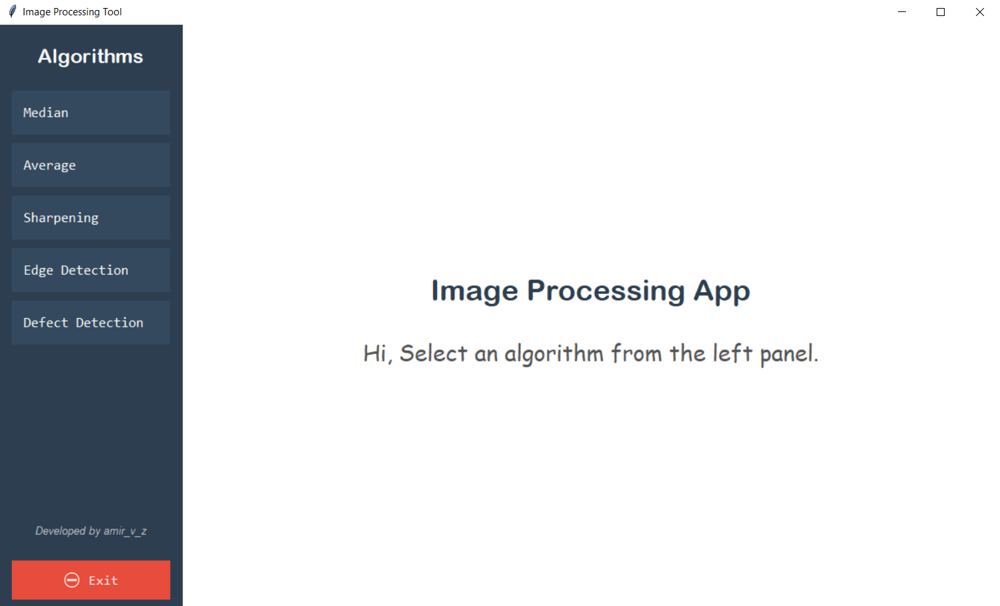
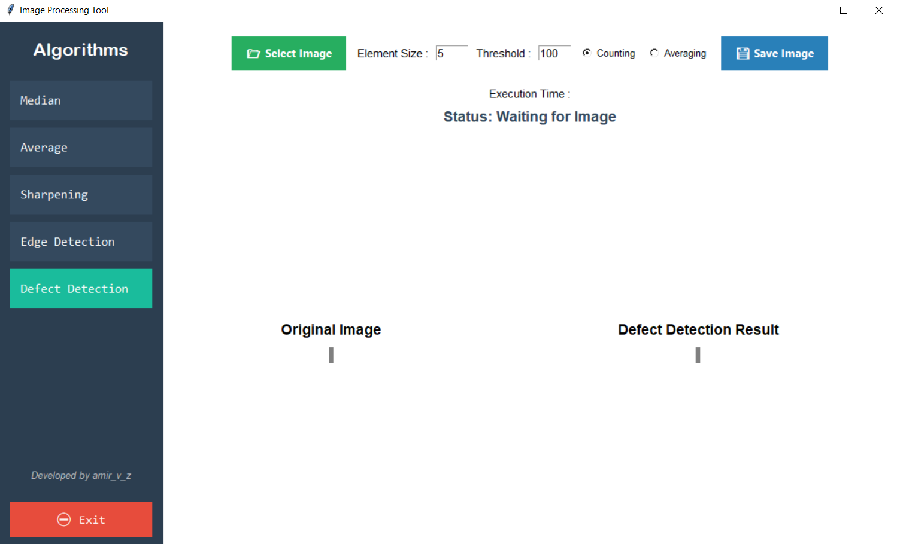

## 🏗 ساختار پروژه

```
Algorithms/
│
├── filters/                  # پوشه الگوریتم ها
│   ├── average.py               # الگوریتم میانگین
│   ├── edge.py                  # الگوریتم لبه یابی
│   ├── median.py                # الگوریتم میانه
│   ├── sharpen.py               # الگوریتم شارپینگ
│   └── surface_defect.py        # الگوریتم تشخیص ضایعه سطح
│
├── gui/                      # پوشه رابط کاربری
│   ├── average_page.py          # صفحه الگوریتم میانگین
│   ├── common_buttons.py        # دکمه های مشترک
│   ├── default_page.py          # صفحه پیش فرض
│   ├── defect_page.py           # صفحه الگوریتم تشخیص ضایعه سطح
│   ├── edge_page.py             # صفحه الگوریتم لبه یابی
│   ├── median_page.py           # صفحه الگوریتم میانه
│   ├── sharpen_page.py          # صفحه الگوریتم شارپینگ
│   └── sidebar.py               # منو کناری
│
├── img/                      # پوشه نمونه تصاویر
│   ├── photo edge               # برای لبه یابی
│   ├── photo noisy              # برای میانه و میانگین
│   └── photo surface defect     # برای تشخیض ضایعه
|
├── utils/                    # پوشه مشترکات
│   ├── image_io.py              # خواندن و ذخیره تصویر
│   └── display.py               # Tkinter نمایش تصویر در
│
├── main.py                   # فایل مدیریت برنامه
├── README.md
└── requirements.txt          # وابستگی های لازم
```

## 📝 نحوه اجرا

### 1. دانلود پوشه `Algorithms`

### 2. نصب وابستگی‌ها

```bash
pip install -r requirements.txt
```

### 3. فایل `main.py` را اجرا کنید.

```bash
python main.py
```

## تصاویری از برنامه

<div align="center">




</div>